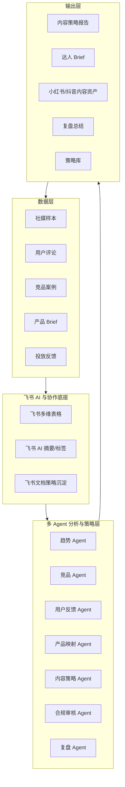

# 架构图说明

```mermaid
flowchart TB
    subgraph Data["数据层"]
        A1["社媒样本"]
        A2["用户评论"]
        A3["竞品案例"]
        A4["产品 Brief"]
        A5["投放反馈"]
    end

    subgraph Feishu["飞书 AI 与协作底座"]
        B1["飞书多维表格"]
        B2["飞书 AI 摘要/标签"]
        B3["飞书文档策略沉淀"]
    end

    subgraph Agents["多 Agent 分析与策略层"]
        C1["趋势 Agent"]
        C2["竞品 Agent"]
        C3["用户反馈 Agent"]
        C4["产品映射 Agent"]
        C5["内容策略 Agent"]
        C6["合规审核 Agent"]
        C7["复盘 Agent"]
    end

    subgraph Output["输出层"]
        D1["内容策略报告"]
        D2["达人 Brief"]
        D3["小红书/抖音内容资产"]
        D4["复盘总结"]
        D5["策略库"]
    end

    Data --> Feishu --> Agents --> Output
    Output --> Data
```

