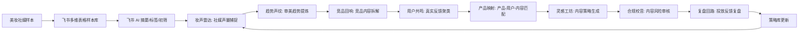

# 妆声引擎 AI 流程图

```mermaid
flowchart LR
    A["美妆社媒样本"] --> B["飞书多维表格样本库"]
    B --> C["飞书 AI 摘要/标签/初筛"]
    C --> D["妆声雷达: 社媒声量捕捉"]
    D --> E["趋势声纹: 审美趋势提炼"]
    E --> F["竞品回响: 竞品内容拆解"]
    F --> G["用户共鸣: 真实反馈聚类"]
    G --> H["产品映射: 产品-用户-内容匹配"]
    H --> I["灵感工坊: 内容策略生成"]
    I --> J["合规校音: 内容风险审核"]
    J --> K["复盘回路: 投放反馈复盘"]
    K --> L["策略库更新"]
    L --> D
```

